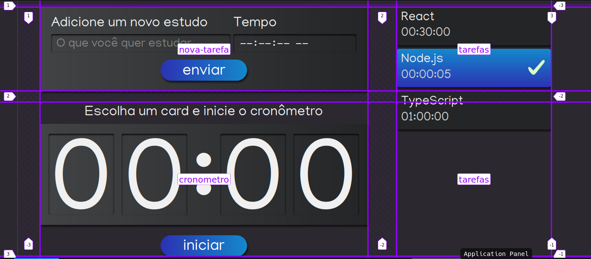

# react-app_stopwatch

## Create React App 

Create React App is a comfortable environment to learn React, and it's the best way to start a single-page application in React.
 
In addition to configuring your development environment to use the latest JavaScript functionality, it provides a pleasant development experience and optimizes your app for production. You will need to have `Node >= 14.0.0` and `npm >= 5.6` on your machine. To create a new project, run:

#### `npx create-react-app my-app`
#### `cd my-app`
#### `npm start`

Source: [React](https://pt-br.reactjs.org/docs/create-a-new-react-app.html)

## How to run?
- Download the project.
- In the file directory run:
#### `npm install`
#### `npm start`

## Topics covered

- [x] Configure your environment to run the project;
  - We learned how to configure your environment to be able to create and run a React project, installing Node/npm and GIT to control versions and/or download the application from Github.
   
- [x] Create a project with create-react-app with template typescript using npm;
  - We created a project using npx, we understand that CRA (Create React App) has the possibility to create projects with template (we chose typescript), choosing npm as our default package manager.
   
- [x] Create React App structures the project;
  - We understand how Create React App structures the application, looking from the configuration files (tsconfig, package.json, package-lock.json among others), to the folders/files that will be updated by us (src folder, app.tsx files, index.tsx, index.css and others).

- [x] How the public folder works;
  - We covered the public folder, what it is for and why we rarely touch it, we also show the index.html file and how React populates it with components.

- [x] Create a component with class component and how to use it;
  - We create a component with class component, showing all the syntax from extends to return and export.

- [x] What is JSX;
  - We saw that React actually returns a JSX, not an HTML, we also talked about some differences between the two.
    
- [x] Create a function component;
  - We also created a component with function component (the most current way of writing components since version 16.8), and we show how simpler it is to create it that way.
    
- [x] Use the map method to render arrays.
  - We render JSX arrays with the map method, showing that this way we can take advantage of part of JSX and change only the value from item to item, using the DRY (Don't Repeat Yourself) principle.
 
- [x] Use inline CSS;
  - We learned how to create CSS inline directly on the attribute, as a JS variable and using conditionals to change the style.

- [x] Use CSS and Sass in the project;
  - have seen how importing CSS and SASS into the project is easy within a project created with Create React App.

- [x] Put the CSS Modules in a project with Create React App + Typescript;
  - configure the project to accept CSS Modules.
    
- [x] Advantages of using CSS Modules.
  - We discussed the advantages of using CSS Modules in the application.

- [x] Add external information to the component with Props;
  - learned to use external properties to reuse components in a unique way.
    
- [x] The props.children works;
  - saw that React provides a default prop called children, which unlike the other props, is written inside the component, opening and closing the tag as in an HTML tag.
    
- [x] The key is important in arrays in React;
  - understand more in depth how React works with arrays, and how the key is important so that it doesn't get lost between the items in this array.
    
- [x] Consciously use spread operator to pass props to components;
  - use the spread operator to be able to pass all the items of an object as props to the component, we also think about how this can become a problem.

- [x] React uses states to update components;
  - learned how React stores information that will be important for a possible re-rendering of a component.
    
- [x] Create states with function components and class components;
  - create states with both function components and class components, understanding how to create these states in each type.
    
- [x] Control fields of a Form with states;
  - learned the difference of a controlled and uncontrolled form/input, and how we can control them to take/change their fields as we want.
    
- [x] Create interfaces and reuse them;
  - seen how Typescript gives us a way to create interfaces so we can describe more complex types, such as component props.

- [x] Use props and to report a change of state;
  - use the junction of props + state so we can pass state to other components and so we can warn that a state must be changed.

- [x] Share common values between components;
  - learned how to create a state that will be shared between multiple components.
    
- [x] Extending interfaces;
  - use the facility to extend an interface within another interface to reuse code.
    
- [x] Add CSS classes conditionally;
  - learned to use a ternary to change CSS classes of a tag based on some prop with template string.
    
- [x] Create utility folders;
  - discussed ways to create folders with shared utility functions in the application.

- [x] The life cycle of a component works;
  - understand how a component's life cycle works, from its birth to its death.
  - 
- [x] Use useEffect;
  - used useEffect to solve a problem we had and saw how important this hook is in the React ecosystem.

- [x] Unstructure strings;
  - learned that we can destructure strings and that we can put the option downLevelIteration so that we can do this destructuring.
    
- [x] Use recursive function;
  - created a recursive function to solve the countdown problem.

- [x] Refactor a class component to a function component;
  - learned how to refactor a class component to a function component.
